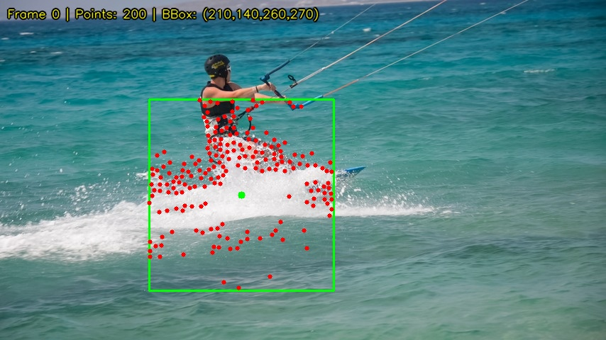
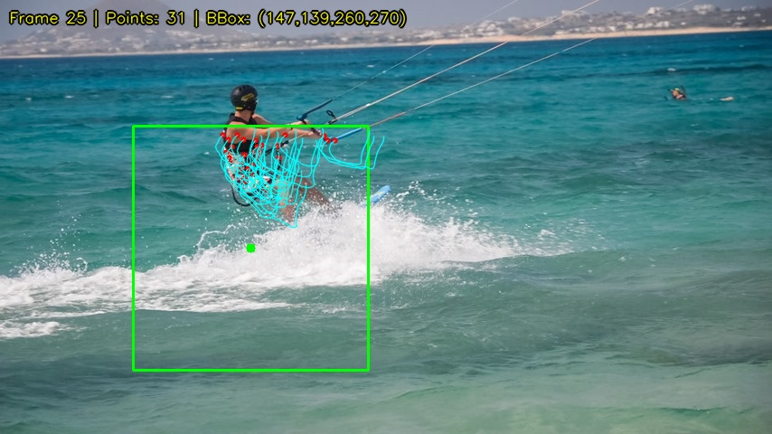
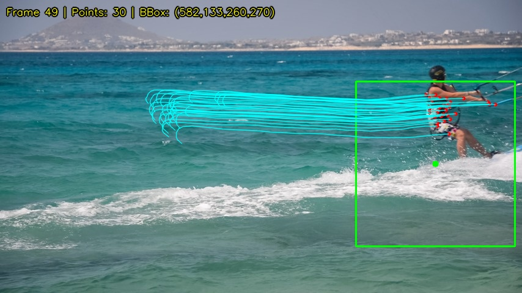

# P3: Theo dõi đối tượng trong video


Dự án thực hành Thị giác Máy — Theo dõi đối tượng bằng **Pyramid Lucas-Kanade** kết hợp phát hiện đặc trưng **Shi-Tomasi** và kiểm tra nhất quán **Forward-Backward**.

## Demo

| Khung hình đầu (Khởi tạo) | Giữa chuỗi | Khung hình cuối |
|:---:|:---:|:---:|
|  |  |  |

> 🟢 Hộp xanh = bounding box &nbsp;|&nbsp; 🔴 Chấm đỏ = điểm đặc trưng &nbsp;|&nbsp; 🔵 Đường cyan = quỹ đạo

## Tính năng chính

- **Pyramid Lucas-Kanade** (3 mức) — ước lượng chuyển động lớn qua kim tự tháp ảnh
- **Shi-Tomasi** — phát hiện điểm góc thỏa điều kiện theo dõi được
- **Forward-Backward check** — loại bỏ điểm ngoại lai bằng kiểm tra nhất quán
- **Median displacement** — cập nhật bbox robust, kháng nhiễu
- **Tự động bổ sung điểm** khi số điểm giảm dưới ngưỡng
- **Đầu ra**: video `.mp4`, quỹ đạo `.csv`, chuỗi ảnh `.jpg`

## Cấu trúc thư mục

```
├── data_survey.py             # Khảo sát dữ liệu (chiếu sáng, chuyển động, cảnh nền)
├── tracker.py                 # Quy trình theo dõi đối tượng
├── experiment.py              # Thử nghiệm & đánh giá tự động
│
├── data/                      # Dữ liệu đầu vào (6 chuỗi khung hình)
├── output/                    # Kết quả theo dõi (video, ảnh, CSV)
├── reports/                   # Báo cáo đánh giá & biểu đồ
└── docs/                      # Tài liệu (báo cáo, đề bài)
```

## Cài đặt

**Yêu cầu**: Python 3.8+

```bash
git clone https://github.com/MinhThang1009/CV-project-01.git
cd CV-project-01

python -m venv venv
venv\Scripts\activate            # Windows
# source venv/bin/activate       # Linux/Mac

pip install -r requirements.txt
```

## Cách sử dụng

```bash
# 1. Khảo sát dữ liệu (P3.4.1)
python data_survey.py --dataset all --no_display

# 2. Theo dõi đối tượng — chọn ROI bằng chuột (P3.4.2)
python tracker.py --dataset kite-surf --win_size 21

# 3. Theo dõi với bbox có sẵn (không cần GUI)
python tracker.py --dataset kite-surf --bbox 210 140 260 270 --no_display

# 4. Chạy thử nghiệm & đánh giá (P3.4.3 + P3.4.4)
python experiment.py --no_display
```

## Kết quả

### So sánh kích thước cửa sổ trên `kite-surf`

| WinSize | Ổn định (std↓) | Tồn tại (%) ↑ | Dịch chuyển TB (px) | Jitter (%) ↓ |
|:-------:|:--------------:|:-------------:|:-------------------:|:------------:|
| 15×15   | 7.20           | 11.5          | 11.18               | 0.0          |
| **21×21** | **7.14**     | 15.0          | 11.24               | **0.0**      |
| 31×31   | 7.16           | **20.5**      | 11.13               | 0.0          |

### So sánh giữa các dataset (winSize=21)

| Dataset   | Ổn định (std↓) | Tồn tại (%) ↑ | Điểm TB | Jitter (%) ↓ |
|:---------:|:--------------:|:-------------:|:-------:|:------------:|
| kite-surf | 7.14           | 15.0          | 40      | 0.0          |
| **soapbox** | **4.38**     | 15.8          | **72**  | **0.0**      |

> **Nhận xét**: `winSize=21` cho bbox ổn định nhất. Đối tượng di chuyển chậm hơn (`soapbox`) dễ theo dõi hơn. Tất cả cấu hình đều đạt jitter 0%.

## Tổng quan phương pháp

```
Frame₀ ──► Gaussian Blur ──► Shi-Tomasi ──► Tập điểm P₀
                                                │
Frame_i ──► Gaussian Blur ──► Pyramid LK  ◄────┘
                                   │
                        Forward-Backward Check
                                   │
                        Median Displacement
                                   │
                        Cập nhật BBox + Quỹ đạo
                                   │
                     Điểm < 10? ──► Phát hiện lại Shi-Tomasi
```

## Tài liệu tham khảo

- **Lucas & Kanade** (1981). *An iterative image registration technique with an application to stereo vision.*
- **Shi & Tomasi** (1994). *Good features to track.*
- **Bouguet** (2000). *Pyramidal implementation of the Lucas-Kanade feature tracker.*

## Tài liệu dự án

- 📄 [Báo cáo dự án](docs/report.md) — Phân tích, phương pháp và kết quả chi tiết
- 📋 [Đề bài](docs/assignment.md) — Yêu cầu dự án gốc
