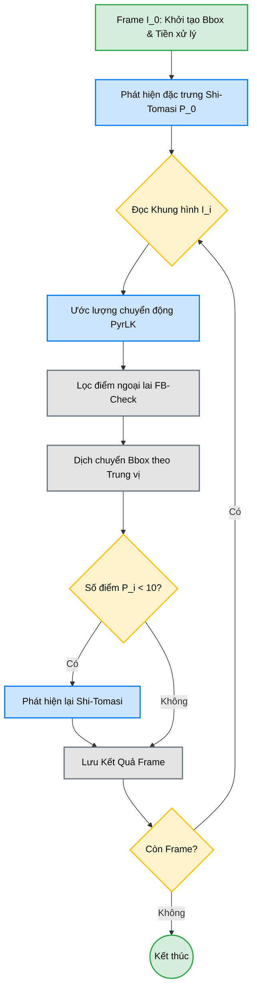

<div align="center">
  <h1 align="center">🎯 Theo dõi Đối tượng trong Video (Object Tracking)</h1>
  <p align="center">
    <strong>Dự án thực hành Thị giác Máy — Theo dõi đối tượng bằng Pyramid Lucas-Kanade kết hợp phát hiện đặc trưng Shi-Tomasi và kiểm tra nhất quán Forward-Backward.</strong>
  </p>
  <p align="center">
    <a href="https://www.python.org/"></a>
    <a href="https://opencv.org/"></a>
    <a href="https://numpy.org/"></a>
  </p>
</div>

---

## 📑 Mục lục
1. [Giới thiệu chung](#1-giới-thiệu-chung)
2. [Tính năng nổi bật](#2-tính-năng-nổi-bật)
3. [Demo Trực quan](#3-demo-trực-quan)
4. [Kiến trúc & Tổng quan phương pháp](#4-kiến-trúc--tổng-quan-phương-pháp)
5. [Cấu trúc thư mục](#5-cấu-trúc-thư-mục)
6. [Hướng dẫn Cài đặt](#6-hướng-dẫn-cài-đặt)
7. [Cách Sử dụng](#7-cách-sử-dụng)
8. [Đánh giá & Kết quả](#8-đánh-giá--kết-quả)
9. [Tài liệu tham khảo](#9-tài-liệu-tham-khảo)

---

<div align="justify">

## 1. 📖 Giới thiệu chung

Dự án này triển khai một hệ thống theo dõi đối tượng (Object Tracking) dựa trên đặc trưng hình ảnh. Thuật toán cốt lõi sử dụng luồng quang học (Optical Flow) **Pyramid Lucas-Kanade** để ước lượng chuyển động, kết hợp với bộ dò góc **Shi-Tomasi** để trích xuất các điểm đặc trưng tốt nhất. Để tăng tính bền vững (robustness), hệ thống tích hợp bộ lọc **Forward-Backward consistency** để loại bỏ các điểm bị trôi (drift) hoặc che khuất (occlusion).

## 2. ✨ Tính năng nổi bật

- 🔭 **Pyramid Lucas-Kanade (3 mức):** Ước lượng chuyển động lớn thông qua xử lý kim tự tháp ảnh đa độ phân giải.
- 🎯 **Shi-Tomasi Corner Detection:** Trích xuất các điểm góc ổn định, thỏa mãn các điều kiện bám bắt tốt nhất.
- 🛡️ **Forward-Backward Consistency Check:** Cơ chế lọc nhiễu tự động, phát hiện và loại bỏ các điểm theo dõi sai lệch.
- 📐 **Cập nhật Bounding Box bằng Trung vị (Median):** Sử dụng `median displacement` thay vì `mean` giúp giảm thiểu tác động của nhiễu.
- 🔄 **Auto Re-detection:** Tự động phát hiện và bổ sung điểm đặc trưng mới khi số lượng điểm hiện tại giảm dưới ngưỡng (ngăn chặn mất dấu).
- 📊 **Phân tích Tự động & Xuất báo cáo:** Đánh giá độ ổn định, tỷ lệ sống sót của điểm (survival rate) và tự động xuất biểu đồ, quỹ đạo.

## 3. 🎞️ Demo Trực quan

Dưới đây là kết quả theo dõi trên tập dữ liệu `kite-surf` (chuyển động nhanh) sử dụng `winSize=21`.

| Khởi tạo (Frame 0) | Giữa chuỗi (Frame 25) | Kết thúc (Frame 49) |
|:---:|:---:|:---:|
|  |  |  |

> 🟢 **Hộp xanh (Bounding Box)** &nbsp;\|&nbsp; 🔴 **Chấm đỏ (Đặc trưng được theo dõi)** &nbsp;\|&nbsp; 🔵 **Đường màu Cyan (Quỹ đạo chuyển động)**

## 4. 🧠 Kiến trúc & Tổng quan phương pháp

Sơ đồ quy trình thực thi (Pipeline) theo dõi qua từng khung hình:



## 5. 📂 Cấu trúc thư mục

Dự án tuân thủ chuẩn tổ chức thư mục cho Machine Learning / Computer Vision:

```text
📦 CV-project-01
├── 📜 README.md                  # Tài liệu giới thiệu dự án
├── 📜 LICENSE                    # Giấy phép mã nguồn mở (MIT)
├── 📜 requirements.txt           # Danh sách thư viện phụ thuộc
├── 📜 .gitignore                 # Cấu hình bỏ qua file cho Git
│
├── 💻 data_survey.py             # Script khảo sát dữ liệu (ánh sáng, chuyển động)
├── 💻 tracker.py                 # Core Pipeline theo dõi đối tượng
├── 💻 experiment.py              # Kịch bản thử nghiệm & đánh giá
│
├── 📂 data/                      # Chứa dữ liệu đầu vào (6 chuỗi ảnh)
├── 📂 output/                    # Kết quả xuất ra (Video .mp4, Ảnh, CSV)
├── 📂 reports/                   # Báo cáo đánh giá (Biểu đồ .jpg, Text .txt)
└── 📂 docs/                      # Tài liệu tham chiếu
    ├── 📄 report.md              # Báo cáo chi tiết phương pháp & thực nghiệm
    └── 📄 assignment.md          # Yêu cầu đề bài gốc
```

## 6. 💻 Hướng dẫn Cài đặt

Yêu cầu hệ thống: **Python 3.8+**

**Bước 1: Clone kho lưu trữ**
```bash
git clone https://github.com/MinhThang1009/CV-project-01.git
cd CV-project-01
```

**Bước 2: Khởi tạo môi trường ảo (Khuyến nghị)**
```bash
# Trên Windows
python -m venv venv
venv\Scripts\activate

# Trên Linux/macOS
python3 -m venv venv
source venv/bin/activate
```

**Bước 3: Cài đặt các thư viện phụ thuộc**
```bash
pip install -r requirements.txt
```

## 7. 🚀 Cách Sử dụng

Dự án cung cấp 3 module chính với các chức năng độc lập:

**1. Phân tích & Khảo sát tập dữ liệu (P3.4.1)**
```bash
python data_survey.py --dataset all --no_display
```

**2. Chạy Tracker với ROI Tùy chọn (P3.4.2)**
*(Hệ thống sẽ mở khung hình đầu, dùng chuột kéo thả để vẽ Bounding Box, nhấn `SPACE` hoặc `ENTER` để bắt đầu)*
```bash
python tracker.py --dataset kite-surf --win_size 21
```

**3. Chạy Tracker với Bounding Box định sẵn (Chế độ Headless)**
```bash
python tracker.py --dataset kite-surf --bbox 210 140 260 270 --no_display
```

**4. Chạy toàn bộ Thử nghiệm tự động (P3.4.3 & P3.4.4)**
```bash
python experiment.py --no_display
```

## 8. 📈 Đánh giá & Kết quả

Đánh giá định lượng được thực hiện trên các chỉ số: **Stability** (Độ ổn định của Bbox), **Survival Rate** (Tỷ lệ điểm giữ được), và **Jitter** (Độ giật lag).

### 8.1. Đánh giá Kích thước Cửa sổ (trên `kite-surf`)

| Cấu hình (WinSize) | Ổn định (std↓) | Tồn tại (%) ↑ | Dịch chuyển TB (px) | Jitter (%) ↓ |
|:------------------:|:--------------:|:-------------:|:-------------------:|:------------:|
| 15×15              | 7.20           | 11.5          | 11.18               | 0.0          |
| **21×21**          | **7.14**       | 15.0          | 11.24               | **0.0**      |
| 31×31              | 7.16           | **20.5**      | 11.13               | 0.0          |

### 8.2. So sánh Chéo Tập dữ liệu (winSize = 21)

| Dataset | Đặc tính | Ổn định (std↓) | Tồn tại (%) ↑ | Điểm TB | Jitter (%) ↓ |
|:-------:|:---------|:--------------:|:-------------:|:-------:|:------------:|
| `kite-surf` | Chuyển động nhanh | 7.14 | 15.0 | 40 | 0.0 |
| **`soapbox`** | Chuyển động chậm | **4.38** | 15.8 | **72** | **0.0** |

> 📌 **Kết luận chính:** Cửa sổ `winSize=21` cung cấp sự cân bằng tốt nhất giữa độ ổn định và chi phí tính toán. Hệ thống hoạt động xuất sắc (jitter=0%) trên mọi cấu hình nhờ cơ chế lọc Median và Forward-Backward.

## 9. 📚 Tài liệu tham khảo

1. **Lucas, B. D., & Kanade, T. (1981).** *An iterative image registration technique with an application to stereo vision.*
2. **Shi, J., & Tomasi, C. (1994).** *Good features to track.* IEEE Conference on Computer Vision and Pattern Recognition.
3. **Bouguet, J. Y. (2000).** *Pyramidal implementation of the Lucas-Kanade feature tracker.* Intel Corporation.
4. Chi tiết thực nghiệm xem thêm tại 📄 [Báo cáo Dự án](docs/report.md).
5. Yêu cầu chi tiết tại 📋 [Đề bài](docs/assignment.md).

</div>
