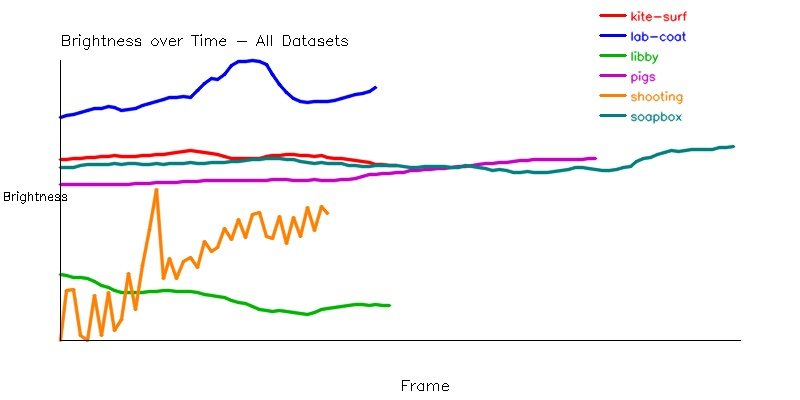
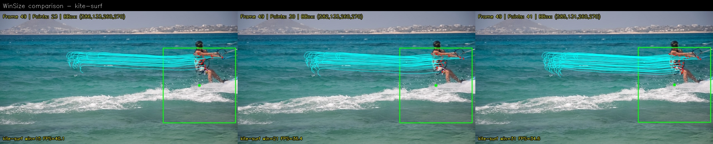
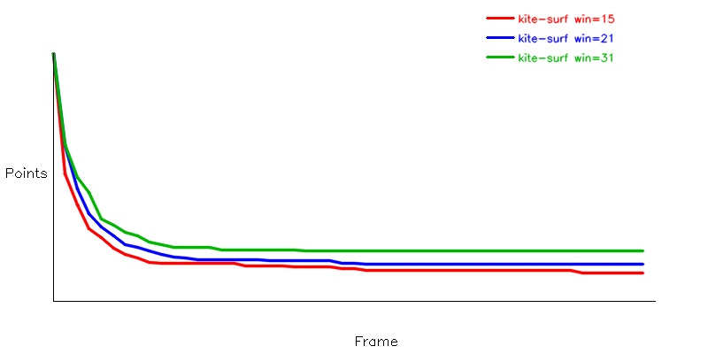
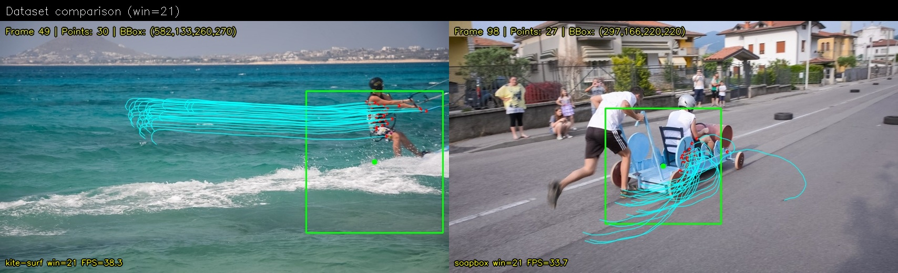
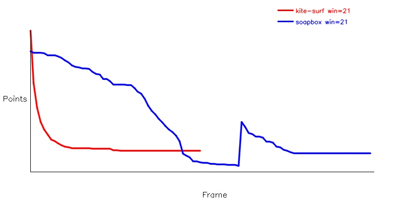

<div align="center">
  <h1 align="center">📄 BÁO CÁO DỰ ÁN P3: THEO DÕI ĐỐI TƯỢNG TRONG VIDEO</h1>
</div>

---

## 1. 🎯 Phát biểu bài toán và mục tiêu

Bài toán theo dõi đối tượng (object tracking) nhằm xác định vị trí của đối tượng theo thời gian, duy trì sự liên tục giữa các khung hình và mô tả quỹ đạo chuyển động trong chuỗi video. Khác với xử lý ảnh tĩnh (chỉ xác định đối tượng trong từng ảnh riêng lẻ), bài toán theo dõi khai thác **thông tin chuyển động** giữa các khung hình liên tiếp.

**Mục tiêu dự án**: Xây dựng quy trình theo dõi đối tượng từ dữ liệu chuỗi ảnh, sử dụng phương pháp Feature-based Tracking dựa trên thuật toán Pyramid Lucas-Kanade (Optical Flow).


## 2. 📊 Mô tả dữ liệu

Dữ liệu gồm 6 chuỗi khung hình (ảnh .jpg) trong thư mục `data/`:

| Dataset   | Frames | Độ phân giải | Chiếu sáng     | Chuyển động          | Cảnh nền     |
|-----------|--------|-------------|----------------|----------------------|-------------|
| kite-surf | 50     | 854×480     | Ổn định        | Nhanh (12.74 px/f)   | Trung bình  |
| lab-coat  | 47     | 854×480     | Thay đổi nhẹ   | Nhanh (7.73 px/f)    | Trung bình  |
| libby     | 49     | 854×480     | Thay đổi nhẹ   | Nhanh (19.71 px/f)   | Trung bình  |
| pigs      | 79     | 854×480     | Thay đổi nhẹ   | Trung bình (2.17 px/f) | Phức tạp  |
| shooting  | 40     | 1152×480    | Thay đổi mạnh  | Nhanh (6.44 px/f)    | Đơn giản    |
| soapbox   | 99     | 854×480     | Ổn định        | Nhanh (3.79 px/f)    | Trung bình  |

**Nhận xét dữ liệu:**
- Dataset `libby` có tốc độ chuyển động lớn nhất (19.71 px/frame), có khả năng gây khó khăn cho thuật toán LK cơ bản (vi phạm giả định chuyển động ngắn < 3px).
- Dataset `pigs` có cảnh nền phức tạp nhất (14.89% edge density) với nhiều đối tượng.
- Dataset `shooting` có biến đổi chiếu sáng mạnh nhất (std = 18.49), ảnh hưởng đến giả định brightness constancy.
- Dataset `soapbox` và `kite-surf` có chiếu sáng ổn định, phù hợp nhất để đánh giá thuật toán.

> 📄 **Kết quả phân tích chi tiết:** [`reports/data_survey_results.csv`](../reports/data_survey_results.csv)

**Biểu đồ biến thiên chiếu sáng:**
<div align="center">
  
  <br>
  <em>Hình 1: Đánh giá biến thiên chiếu sáng giữa các tập dữ liệu</em>
</div>


## 3. ⚙️ Mô tả quy trình theo dõi

### 3.1. Lựa chọn phương pháp

**Phương pháp**: Feature-based Tracking dùng Optical Flow (Pyramid Lucas-Kanade).

**Lý do lựa chọn**:
- Phù hợp với dữ liệu chuỗi ảnh liên tiếp, tận dụng thông tin chuyển động giữa các khung hình.
- Pyramid LK (Mục 6.2.3) giải quyết được hạn chế chuyển động ngắn bằng kim tự tháp ảnh đa mức.
- Shi-Tomasi đảm bảo chọn được các điểm thỏa mãn **điều kiện theo dõi được** (2 giá trị riêng của ma trận cấu trúc M đều đủ lớn — Mục 6.2.1).

### 3.2. Các bước trong quy trình

Quy trình tuân theo khung thuật toán trong Mục 6.2.4:

**Bước 1 — Khởi tạo tại khung hình I₀:**
1. **Tiền xử lý**: Làm mượt ảnh bằng bộ lọc Gaussian (kernel 5×5, σ=1.0 — Mục 4.1.2) để giảm nhiễu cộng.
2. **Chọn vùng quan tâm (ROI)**: Người dùng khoanh vùng đối tượng bằng chuột (`cv2.selectROI`).
3. **Phát hiện điểm đặc trưng**: Dùng Shi-Tomasi (`cv2.goodFeaturesToTrack`) để tìm tập điểm P₀ chỉ nằm trong ROI. Các tham số: maxCorners=200, qualityLevel=0.01, minDistance=7, blockSize=7.

**Bước 2 — Theo dõi qua từng khung hình Iᵢ (i > 0):**
1. **Ước lượng chuyển động**: Dùng `cv2.calcOpticalFlowPyrLK` (Pyramid Lucas-Kanade) để tính vector chuyển động cho mỗi điểm trong Pᵢ₋₁.
   - Số mức kim tự tháp: maxLevel = 3 (Mục 6.2.3)
   - Kích thước cửa sổ: winSize = 21×21 (Mục 6.2.1)
   - Số vòng lặp LK: 30, ngưỡng hội tụ: 0.01 (Mục 6.2.2)
2. **Lọc điểm ngoại lai (ràng buộc R)**: Áp dụng Forward-Backward check — theo dõi ngược từ Iᵢ về Iᵢ₋₁, nếu khoảng cách giữa điểm gốc và điểm quay ngược > 1px thì loại bỏ (phát hiện che khuất, drift).
3. **Cập nhật bounding box**: Tính trung vị (median) của vector dịch chuyển các điểm tốt → dịch chuyển bbox. Dùng median thay vì mean để robust hơn với nhiễu.
4. **Bổ sung điểm mới**: Nếu số điểm < 10 (ngưỡng MIN_POINTS), phát hiện lại các góc Shi-Tomasi trong ROI hiện tại và bổ sung vào tập theo dõi.

**Bước 3 — Lưu kết quả:**
- Vẽ bounding box + điểm đặc trưng + quỹ đạo (trails) lên mỗi khung hình.
- Xuất video đầu ra (.mp4).
- Xuất quỹ đạo đối tượng ra file CSV (frame, center_x, center_y, bbox_x, bbox_y, bbox_w, bbox_h, num_points).
- Lưu chuỗi ảnh kết quả vào `output/`.


## 4. 🧪 Các phương án thực nghiệm

### Kịch bản 1: So sánh kích thước cửa sổ (winSize)

So sánh 3 cấu hình tham số trên cùng dataset:
- winSize = 15×15
- winSize = 21×21
- winSize = 31×31

**Mục đích**: Đánh giá ảnh hưởng của kích thước cửa sổ W (Mục 6.2.1) đến độ chính xác ước lượng chuyển động. Cửa sổ lớn hơn cho phép bắt chuyển động dài hơn nhưng giảm khả năng phân biệt chi tiết cục bộ.

### Kịch bản 2: So sánh giữa các video

So sánh kết quả trên 2 dataset có điều kiện chuyển động khác nhau:
- `kite-surf`: chuyển động nhanh (12.74 px/frame), ngoài trời
- `soapbox`: chuyển động vừa (3.79 px/frame), chuỗi dài (99 frames)

**Mục đích**: Đánh giá khả năng thích ứng của thuật toán với các tốc độ chuyển động và độ dài chuỗi khác nhau.

*(Chi tiết kết quả trực quan và biểu đồ được trình bày cụ thể ở phần 5).*


## 5. 📈 Kết quả theo dõi và so sánh

### 5.1. Chỉ số đánh giá (P3.4.4)

Các chỉ số định lượng được sử dụng:

| Chỉ số | Ý nghĩa |
|--------|---------|
| **Bbox Stability (std)** | Độ lệch chuẩn của displacement giữa các frame (px). Nhỏ = ổn định. |
| **Point Survival (%)** | Tỷ lệ điểm đặc trưng còn lại ở frame cuối so với frame đầu. |
| **Avg Displacement** | Tốc độ dịch chuyển trung bình của bbox (px/frame). |
| **Jitter Rate (%)** | Phần trăm frame có displacement đột biến (>3× trung bình). |
| **Avg Points** | Số điểm đặc trưng trung bình được duy trì trong suốt quá trình theo dõi. |

### 5.2. Kết quả thực nghiệm

**Kịch bản 1: So sánh winSize trên `kite-surf`**

| Dataset   | WinSize | FPS  | Stability (std) | Survival % | Avg Disp (px) | Jitter % | Avg Points |
|-----------|---------|------|-----------------|-----------|---------------|----------|------------|
| kite-surf | 15      | 40.1 | 7.20            | 11.5      | 11.18         | 0.0      | 34         |
| kite-surf | 21      | 36.4 | **7.14**        | 15.0      | 11.24         | 0.0      | 40         |
| kite-surf | 31      | 34.6 | 7.16            | **20.5**  | 11.13         | 0.0      | **50**     |

→ **Kết luận**: winSize=21 cho bbox ổn định nhất (std=7.14px). winSize=31 giữ được nhiều điểm nhất (20.5% survival, 50 điểm TB) nhờ cửa sổ lớn hơn bắt được chuyển động dài hơn. winSize=15 mất nhiều điểm nhất (chỉ 11.5% survival) do cửa sổ quá nhỏ so với tốc độ chuyển động (12.74 px/frame).

<div align="center">
  
  <br>
  <em>Hình 2: So sánh trực quan bounding box giữa các cấu hình winSize</em>
</div>

<div align="center">
  
  <br>
  <em>Biểu đồ 1: Sự biến thiên số lượng điểm đặc trưng theo thời gian</em>
</div>

**Kịch bản 2: So sánh dataset (winSize=21)**

| Dataset   | WinSize | FPS  | Stability (std) | Survival % | Avg Disp (px) | Jitter % | Avg Points |
|-----------|---------|------|-----------------|-----------|---------------|----------|------------|
| kite-surf | 21      | 38.3 | 7.14            | 15.0      | 11.24         | 0.0      | 40         |
| soapbox   | 21      | 33.7 | **4.38**        | 15.8      | **6.76**      | 0.0      | **72**     |

→ **Kết luận**: `soapbox` dễ theo dõi hơn `kite-surf` (stability 4.38 vs 7.14). Bbox di chuyển ít hơn (6.76 vs 11.24 px/frame) và giữ được nhiều điểm hơn (72 vs 40 TB). Điều này phù hợp với kết quả khảo sát dữ liệu: `kite-surf` có tốc độ chuyển động cao hơn (12.74 vs 3.79 px/frame).

<div align="center">
  
  <br>
  <em>Hình 3: Khả năng duy trì bám bắt trên hai video có đặc tính chuyển động khác biệt</em>
</div>

<div align="center">
  
  <br>
  <em>Biểu đồ 2: So sánh tỷ lệ tồn tại của các điểm đặc trưng giữa hai dataset</em>
</div>

> 📄 **Báo cáo log dạng text:** [`reports/eval_winsize_kite-surf.txt`](../reports/eval_winsize_kite-surf.txt), [`reports/eval_datasets_win21.txt`](../reports/eval_datasets_win21.txt)


## 6. 💡 Nhận xét và kết luận

### 6.1. Nhận xét

**Về khả năng duy trì liên tục vị trí đối tượng:**
- Bbox bám sát đối tượng trong suốt chuỗi video trên cả 2 dataset. Forward-backward check loại bỏ hiệu quả các điểm bị drift.
- Trên `soapbox`, cơ chế bổ sung điểm mới kích hoạt tại frame 60 (khi điểm giảm dưới MIN_POINTS=10), giúp tracker phục hồi.
- Point survival rate khoảng 15-20%, cho thấy phần lớn điểm bị mất do forward-backward check nghiêm ngặt (threshold=1px). Điều này đánh đổi giữa số lượng và chất lượng điểm.

**Về mức độ ổn định theo thời gian:**
- Jitter rate = 0% trên tất cả cấu hình → quỹ đạo bbox luôn mượt, không có nhảy đột ngột.
- Median displacement (thay vì mean) đóng vai trò quan trọng: khi nhiều điểm bị drift, median vẫn cho vector dịch chuyển chính xác.
- winSize lớn hơn (31) giúp duy trì nhiều điểm hơn nhưng không cải thiện đáng kể stability.

**Về ảnh hưởng che khuất và chiếu sáng:**
- Trên `kite-surf` (chiếu sáng ổn định, std=1.53), tracking chạy mượt suốt 50 frames.
- Trên `soapbox`, khi xe soapbox bị một phần che khuất bởi người đẩy (frame 50-70), số điểm giảm nhanh → cần bổ sung điểm mới.
- Dataset `shooting` có thay đổi chiếu sáng mạnh nhất (std=18.49), dự kiến gây khó khăn cho thuật toán do vi phạm giả định brightness constancy (công thức 6.13).

**Về ảnh hưởng tham số:**
- Cửa sổ LK nhỏ (15×15) không đủ cho chuyển động nhanh → mất 88.5% điểm. Phù hợp với lý thuyết: giả định chuyển động ngắn (Mục 6.2.1) bị vi phạm khi displacement > winSize/2.
- Tăng winSize lên 31×31 cải thiện point survival gần gấp đôi (20.5% vs 11.5%) nhưng FPS giảm (34.6 vs 40.1).

### 6.2. Kết luận

Dự án đã xây dựng thành công một quy trình theo dõi đối tượng dựa trên thuật toán Pyramid Lucas-Kanade, đi từ dữ liệu chuỗi ảnh đến kết quả bám bắt đối tượng theo thời gian. Kết quả thực nghiệm cho thấy:

1. **Chuyển động ảnh** (optical flow ước lượng bằng Pyramid LK) bắt chính xác hướng và tốc độ di chuyển của đối tượng, thể hiện qua quỹ đạo trails nhất quán.
2. **Đặc trưng quan sát được** (Shi-Tomasi corners) đảm bảo chọn được điểm dễ theo dõi, nhưng bị mất dần theo thời gian do biến dạng và che khuất → cần cơ chế bổ sung.
3. **Khả năng duy trì sự liên tục** được đảm bảo qua forward-backward check (lọc outlier) và median displacement (robust với nhiễu).

**Hạn chế**: Phương pháp hiện tại chỉ dịch chuyển bbox (translation) mà không thay đổi kích thước (scale), nên không thích ứng tốt khi đối tượng tiến lại gần hoặc ra xa camera. Có thể cải thiện bằng cách ước lượng scale change từ khoảng cách giữa các điểm đặc trưng.


## 7. 📦 Sản phẩm nộp (P3.6)

| Sản phẩm | File/Thư mục |
|----------|-------------|
| Mã nguồn chương trình | `data_survey.py`, `tracker.py`, `experiment.py` |
| Báo cáo dự án | `docs/report.md` (file này) |
| Video đầu ra | `output/*/tracking_*.mp4` |
| Chuỗi ảnh kết quả | `output/*/frame_*.jpg` |
| Quỹ đạo đối tượng | `output/*/trajectory_*.csv` |
| Kết quả phân tích dữ liệu | `reports/data_survey_results.csv` |
| Ảnh so sánh + biểu đồ | `reports/*.jpg` |
| Báo cáo đánh giá | `reports/eval_*.txt` |

### Cấu trúc thư mục dự án

```
├── requirements.txt        # Dependencies
├── .gitignore
│
├── data_survey.py          # P3.4.1 - Khảo sát dữ liệu
├── tracker.py              # P3.4.2 - Quy trình theo dõi (Pyramid LK + Shi-Tomasi)
├── experiment.py           # P3.4.3 & P3.4.4 - So sánh & đánh giá
│
├── data/                   # Dữ liệu đầu vào (6 chuỗi khung hình)
│   ├── kite-surf/          #   50 frames
│   ├── lab-coat/           #   47 frames
│   ├── libby/              #   49 frames
│   ├── pigs/               #   79 frames
│   ├── shooting/           #   40 frames
│   └── soapbox/            #   99 frames
│
├── output/                 # Kết quả theo dõi
│   ├── kite-surf_win15/    #   tracking_*.mp4 + frame_*.jpg + trajectory_*.csv
│   ├── kite-surf_win21/
│   ├── kite-surf_win31/
│   └── soapbox_win21/
│
├── reports/                # Báo cáo phân tích & biểu đồ
│   └── ...
│
└── docs/                   # Tài liệu
    ├── report.md           #   Báo cáo dự án (file này)
    └── assignment.md       #   Đề bài
```


## 📌 Phụ lục: Cách chạy chương trình

```bash
# Cài đặt
python -m venv venv
venv\Scripts\activate
pip install -r requirements.txt

# P3.4.1 - Khảo sát dữ liệu
python data_survey.py --dataset all --no_display

# P3.4.2 - Theo dõi đối tượng (chọn ROI bằng chuột)
python tracker.py --dataset kite-surf --win_size 21

# P3.4.3 & P3.4.4 - Thử nghiệm và đánh giá
python experiment.py --no_display
```
